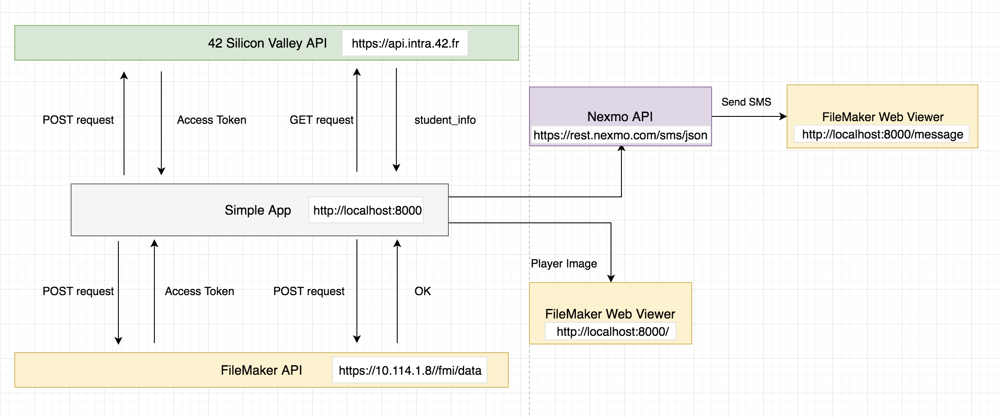

# Overview
This is a project completed for a challege for FileMaker internship. API data manipulation written in Node.js and express with modern syntax Promise, acync, await. Tic Tac Toe game built in FileMaker 17. 

## Buit With
- [42SV data api](https://api.intra.42.fr/apidoc) - Fetch student info data
- [FileMaker 17 data api](https://fmhelp.filemaker.com/docs/17/en/dataapi/index.html) - post to Filemaker server
- [nexmo api](https://dashboard.nexmo.com/getting-started-guide) -  send message to game loser


### Diagram



## Installation
### Download Filemaker and FileMaker server
Please install `FileMaker Pro 17 Advanced` and `FileMaker Server 17` on-premises. 
Host the [TicTacToe game](https://github.com/Lijun21/FileMaker-42-TicTacToe/blob/master/TicTacToeGame.fmp12) to your server.

### Clone source code
```shell
git clone https://github.com/Lijun21/FileMaker-42-TicTacToe.git
```

### Install Js Dependencies
```
npm install
```

### Configuration
create a `config.js` file under the same folder, and copy paste code below.
```
module.exports = {
    clientID42 : 'YOUR_42_CLIENT_ID',
    clientSecret42 : 'YOUR_42_CLIENT_SECRET',
    fmHostURI: 'YOUR_FileMaker_SERVER_URI',
    fmFileName: "Lijun_TicTacToe",
    fmLoginPass: 'bGlqdW46MTIzNA==',
    fmLayoutName: 'Player',
    nexmoKey: 'YOUR_NEXMO_KEY',
    nexmoSecret: 'YOUR_NEXMO_SECRET',
    testModeNumber: '12013713874'
}
```

### Run the server
```
npm start
```


